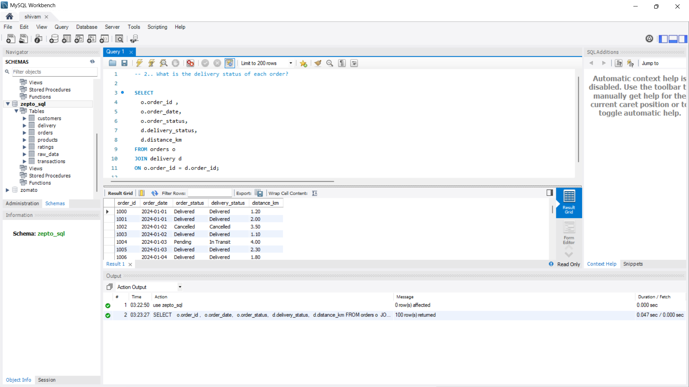
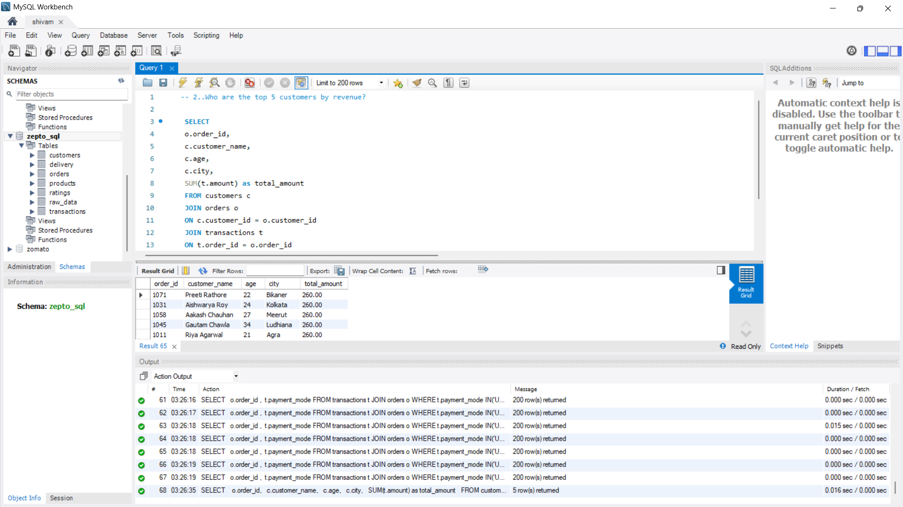

<!-- ================= ZE P T O  SQL  README ================= -->

<h1 align="center">🚀 Zepto SQL Business Analysis</h1>

  

  <b>End-to-End SQL Business Analysis Project</b> 
  Customer • Orders • Revenue • Delivery • Ratings

<h2>📌 Project Overview</h2>

This project focuses on <b>SQL-based business analysis</b> using a
<b>Quick Commerce (Zepto-like)</b> dataset.
The goal is to extract <b>actionable business insights</b> from raw data
using optimized SQL queries.

<h2>📊 Business Problems Solved</h2>

<ul>
  <li>Which product categories generate the highest revenue?</li>
  <li>Who are the top customers?</li>
  <li>How efficient is delivery performance?</li>
  <li>Which products receive the best ratings?</li>
  <li>What are peak ordering time slots?</li>
</ul>

<h2>🧠 Key Insights</h2>

<ul>
  <li>📈 Revenue contribution by category & product</li>
  <li>👥 Customer segmentation based on order behavior</li>
  <li>🚚 Delivery delay & efficiency analysis</li>
  <li>⭐ Product rating & customer satisfaction analysis</li>
  <li>⏰ Time-based order trends</li>
</ul>

<h2>🗂 Dataset Information</h2>

<table border="1" cellpadding="8">
  <tr>
    <th>Table Name</th>
    <th>Description</th>
  </tr>
  <tr>
    <td>customers</td>
    <td>Customer details & demographics</td>
  </tr>
  <tr>
    <td>products</td>
    <td>Product catalog & categories</td>
  </tr>
  <tr>
    <td>orders</td>
    <td>Order-level information</td>
  </tr>
  <tr>
    <td>transactions</td>
    <td>Payment & revenue data</td>
  </tr>
  <tr>
    <td>delivery</td>
    <td>Delivery time & performance</td>
  </tr>
  <tr>
    <td>ratings</td>
    <td>Customer ratings & feedback</td>
  </tr>
</table>

<h2>🛠 Tools & Technologies</h2>

<ul>
  <li>🐬 <b>MySQL</b> – SQL querying & analysis</li>
  <li>📁 <b>CSV Dataset</b></li>
  <li>🧠 <b>Business Logic & KPIs</b></li>
  <li>📌 <b>Git & GitHub</b></li>
</ul>

<h2>📸 Project Screenshots</h2>

  
  

  
  

<h2>📸 Project Screenshots</h2>

  
  

  
  

<h2>⚙️ How to Run This Project</h2>

<pre>
1. Clone the repository
2. Import CSV files into MySQL
3. Create database & tables
4. Run SQL queries step-by-step
</pre>

<h2>📈 Example SQL Queries</h2>

<pre>
SELECT category, SUM(total_amount) AS revenue
FROM orders
GROUP BY category
ORDER BY revenue DESC;
</pre>

<h2>✨ Project Highlights</h2>

<ul>
  <li>✔ Business-oriented SQL queries</li>
  <li>✔ Clean & structured analysis</li>
  <li>✔ Interview-ready project</li>
  <li>✔ Recruiter-friendly documentation</li>
</ul>

<h2>📌 Author</h2>

<b>Shivam Nayak</b> 
Aspiring Data Scientist | SQL • Python • ML

🔗 GitHub:
<a href="https://github.com/shivam-nayak-ds" target="_blank">
github.com/shivam-nayak-ds
</a>

⭐ If you like this project, don’t forget to star the repository!

<!-- ================= END README ================= -->
